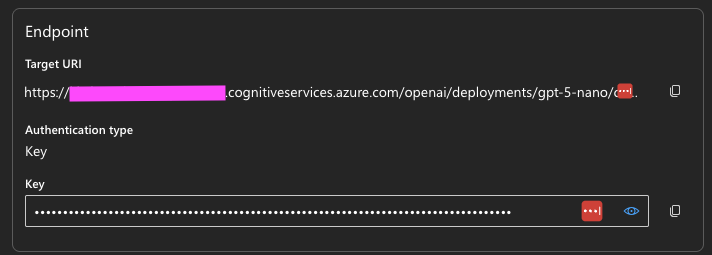
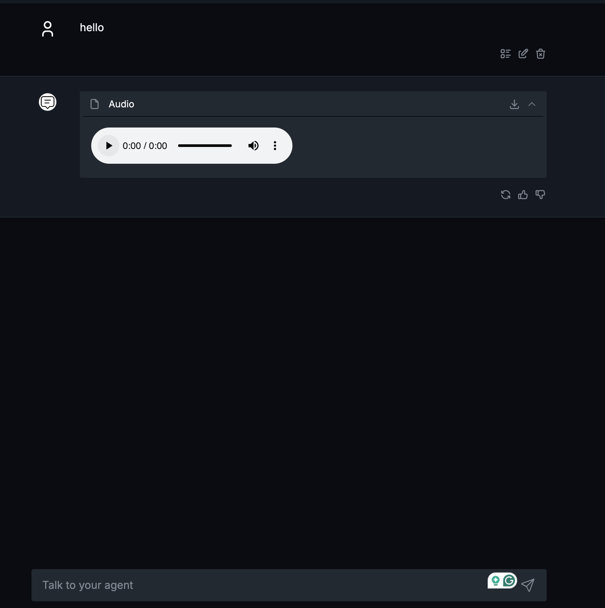
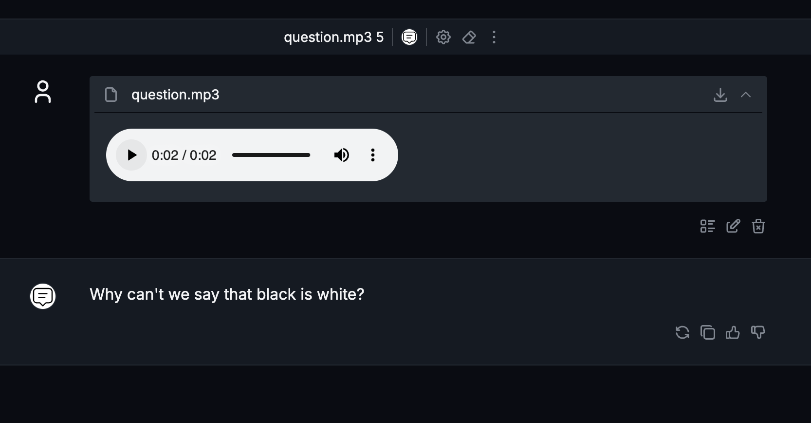
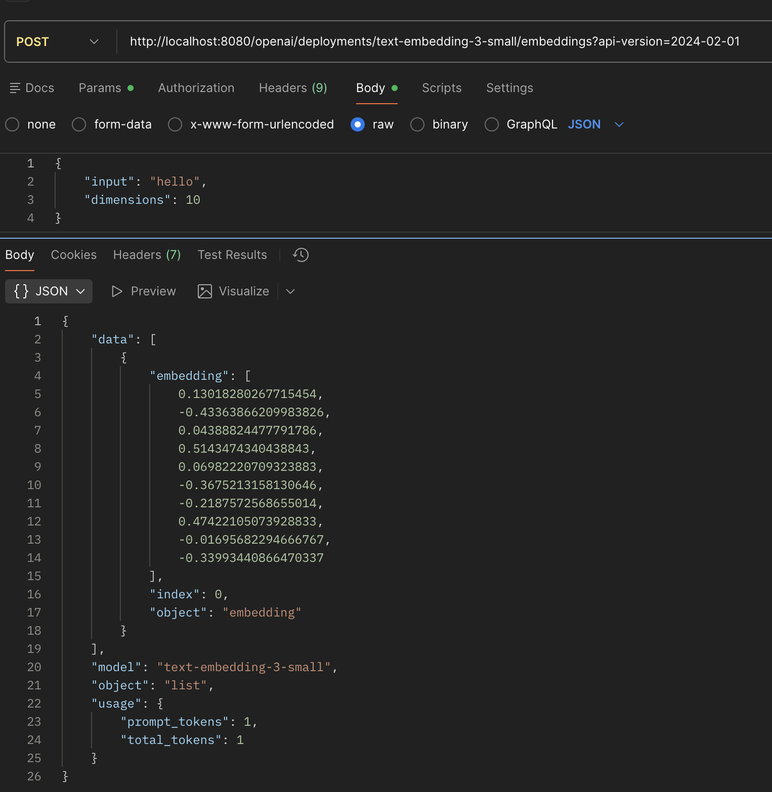

# Set up Azure OpenAI Models

You can use different models from [Azure OpenAI](https://azure.microsoft.com/en-us/products/ai-foundry/models/openai)

Documentation for [adapter-dial-openai](https://github.com/epam/ai-dial-adapter-openai)

## GPT OpenAI Models

In this section we will use [OpenAI Responses API](https://learn.microsoft.com/en-us/azure/ai-foundry/openai/how-to/responses?tabs=python-key) with DIAL:

1. Deploy in Azure `gpt-5-nano` model.
    
2. Open the core config.json
3. Add such config to `models`:
    ```json
        "gpt-5-nano": {
          "type": "chat",
          "overrideName": "gpt-5-nano",
          "endpoint": "http://adapter-dial-openai:5000/openai/deployments/gpt-5-nano/chat/completions",
          "upstreams": [
            {
              "endpoint": "https://${AZURE_OPENAI_SERVICE_NAME}.azure.com/openai/v1/responses",
              "key": "${API_KEY}"
            }
          ]
        },
    ```
   Replace `${AZURE_OPENAI_SERVICE_NAME}` and `${API_KEY}` with endpoint in Azure and generated API key
4. **OPTIONAL if you've done task 4.** Open root `docker-compose.yml` and add such service:
    ```yaml
      adapter-dial-openai:
        image: epam/ai-dial-adapter-openai:development
        # platform: linux/amd64
        environment:
          DIAL_URL: "http://core:8080"
          LOG_LEVEL: "INFO"
    ```
5. Restart DIAL Core service
6. Test it in DIAL Chat

---

## DALL-E

1. Deploy in Azure `dall-e-3` model.
2. Open the core config.json
3. Add such config to `models`:
    ```json
        "dall-e-3": {
          "type": "chat",
          "endpoint": "http://adapter-dial-openai:5000/openai/deployments/dall-e-3/chat/completions",
          "upstreams": [
            {
              "endpoint": "https://${AZURE_OPENAI_SERVICE_NAME}.azure.com/openai/deployments/dall-e-3/images/generations",
              "key": "${API_KEY}"
            }
          ]
        },
    ```
   Replace `${AZURE_OPENAI_SERVICE_NAME}` and `${API_KEY}` with endpoint in Azure and generated API key
4. Open root `docker-compose.yml` and add to `adapter-dial-openai` service such env variables:
    ```yaml
      DIAL_USE_FILE_STORAGE: "True"
      DALLE3_DEPLOYMENTS: dall-e-3
    ```
   More details read in [documentation](https://github.com/epam/ai-dial-adapter-openai?tab=readme-ov-file#azure-openai-images-api)
5. Restart DIAL Core service
6. Test it


---

## TTS

1. Deploy in Azure `tts` model.
2. Open the core config.json
3. Add such config to `models`:
    ```json
        "tts": {
          "type": "chat",
          "endpoint": "http://adapter-dial-openai:5000/openai/deployments/tts/chat/completions",
          "upstreams": [
            {
              "endpoint": "https://${AZURE_OPENAI_SERVICE_NAME}.azure.com/openai/deployments/tts/audio/speech",
              "key": "${API_KEY}"
            }
          ]
        },
    ```
   Replace `${AZURE_OPENAI_SERVICE_NAME}` and `${API_KEY}` with endpoint in Azure and generated API key
4. Restart DIAL Core service
5. Test it
   

---

## STT

### `whisper` From Azure OpenAI

1. Deploy in Azure `whisper` model.
2. Open the core config.json
3. Add such config to `models`:
    ```json
        "whisper": {
          "type": "chat",
          "endpoint": "http://adapter-dial-openai:5000/openai/deployments/whisper/chat/completions",
          "upstreams": [
            {
              "endpoint": "https://${AZURE_OPENAI_SERVICE_NAME}.azure.com/openai/deployments/whisper/audio/transcriptions",
              "key": "${API_KEY}"
            }
          ],
          "inputAttachmentTypes": [
            "audio/mpeg"
          ]
        },
    ```
   Replace `${AZURE_OPENAI_SERVICE_NAME}` and `${API_KEY}` with endpoint in Azure and generated API key
4. Restart DIAL Core service
5. Test it

### `gpt-4o-transcribe` From OpenAI

1. Open the core config.json
2. Add such config to `models`:
    ```json
        "gpt-4o-transcribe": {
          "type": "chat",
          "endpoint": "http://adapter-dial-openai:5000/openai/deployments/gpt-4o-transcribe/chat/completions",
          "upstreams": [
            {
              "endpoint": "https://api.openai.com/v1/audio/transcriptions",
              "key": "${OPENAI_API_KEY}"
            }
          ],
          "inputAttachmentTypes": [
            "audio/mpeg"
          ]
        },
    ```
   Replace `${OPENAI_API_KEY}` with OpenAI API key
3. Restart DIAL Core service
4. Test it
   

---

## Embeddings

1. Deploy in Azure `text-embedding-3-small` model.
2. Open the core config.json
3. Add such config to `models`:
    ```json
        "text-embedding-3-small": {
          "type": "embedding",
          "overrideName": "text-embedding-3-small",
          "endpoint": "http://adapter-dial-openai:5000/openai/deployments/text-embedding-3-small/embeddings",
          "upstreams": [
            {
              "endpoint": "https://${AZURE_OPENAI_SERVICE_NAME}.azure.com/openai/v1/embeddings",
              "key": "${API_KEY}"
            }
          ]
        }
    ```
   Replace `${AZURE_OPENAI_SERVICE_NAME}` and `${API_KEY}` with endpoint in Azure and generated API key
4. Restart DIAL Core service
5. Test it, from DIAL chat you won't be able to access embedding models, use Postman:
    ```json
    curl --location 'http://localhost:8080/openai/deployments/text-embedding-3-small/embeddings?api-version=2024-02-01' \
    --header 'Api-Key: dial_api_key' \
    --header 'Content-Type: application/json' \
    --data '{
        "input": "hello",
        "dimensions": 10
    }'
    ```
   

---

1. Open the core config.json
2. Add such config to `models`:
    ```json
        "text-embedding-3-small": {
          "type": "embedding",
          "overrideName": "text-embedding-3-small",
          "endpoint": "http://adapter-dial-openai:5000/openai/deployments/text-embedding-3-small/embeddings",
          "upstreams": [
            {
              "key": "${OPENAI_API_KEY}"
            }
          ]
        }
    ```
   Replace `${OPENAI_API_KEY}` with OpenIA API key
3. Restart DIAL Core service
4. Test it, from DIAL chat you won't be able to access embedding models, use Postman:
    ```json
    curl --location 'http://localhost:8080/openai/deployments/text-embedding-3-large/embeddings?api-version=2024-02-01' \
    --header 'Api-Key: dial_api_key' \
    --header 'Content-Type: application/json' \
    --data '{
        "input": "hello",
        "dimensions": 10
    }'
    ```